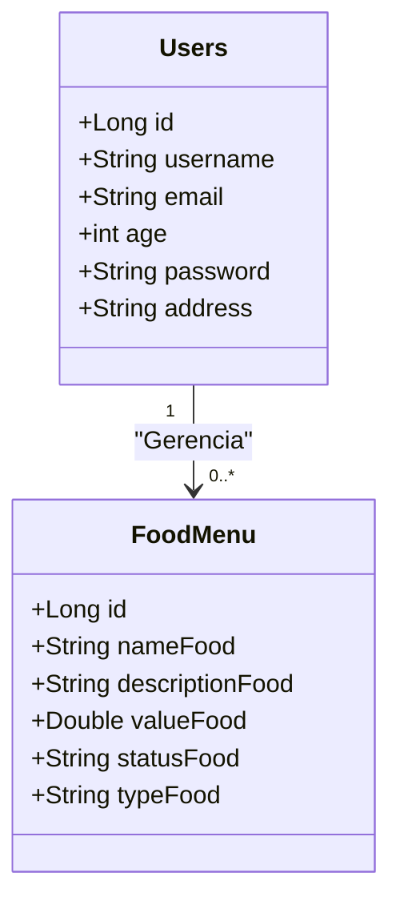

# FoodMenu API

FoodMenu é uma API REST desenvolvida para gerenciar o cardápio de alimentos e usuários. O sistema permite a criação, edição, exclusão e visualização de itens do cardápio, além do gerenciamento de usuários. 

## Tecnologias Utilizadas

- **Java 17**: Linguagem de programação utilizada.
- **Spring Boot 3**: Framework utilizado para facilitar o desenvolvimento da aplicação.
- **Spring Data JPA**: Para interações com o banco de dados.
- **H2 Database**: Banco de dados em memória utilizado para desenvolvimento.
- **PostgreSQL**: Banco de dados utilizado em produção.
- **Swagger/OpenAPI**: Para documentação e testes da API.
- **Spring Security**: Para autenticação e autorização de usuários.
- **Railway**: Plataforma utilizada para o deploy da aplicação.

## Funcionalidades

### Gerenciamento de Cardápio
- **Criar item do menu**: Adicionar novos pratos ao cardápio.
- **Listar itens do menu**: Visualizar todos os pratos disponíveis.
- **Buscar item por ID**: Obter detalhes de um prato específico.
- **Atualizar item do menu**: Editar as informações de um prato.
- **Excluir item do menu**: Remover pratos do cardápio.

### Gerenciamento de Usuários
- **Criar usuário**: Cadastrar novos usuários no sistema.
- **Listar usuários**: Visualizar todos os usuários cadastrados.
- **Buscar usuário por ID**: Obter detalhes de um usuário específico.
- **Atualizar usuário**: Editar as informações de um usuário.
- **Excluir usuário**: Remover usuários do sistema.

## Diagrama de Entidades



## Como Executar

1. **Clone o repositório**:
   ```bash
   git clone https://github.com/DiegoMelnek/FoodMenu.git
   ```

2. **Entre na pasta do projeto**:
   ```bash
   cd FoodMenu
   ```

3. **Execute a aplicação**:
   Utilize sua IDE favorita (por exemplo, Spring Tools 4) ou rode o comando:
   ```bash
   ./gradlew bootRun
   ```

4. **Acesse o Swagger**:
   Após iniciar a aplicação, você pode acessar a documentação da API em:
   ```
   http://localhost:8080/swagger-ui.html
   ```

## Banco de Dados

- Durante o desenvolvimento, a API utiliza o banco de dados H2 em memória. No ambiente de produção, o PostgreSQL é utilizado.
  
## Deploy

- O deploy é feito na plataforma Railway, permitindo fácil acesso e escalabilidade da aplicação.

## Contribuições

Sinta-se à vontade para contribuir com melhorias no projeto por meio de *pull requests*. Sugestões e relatórios de erros também são bem-vindos.

## Licença

Este projeto está licenciado sob a licença MIT - veja o arquivo [LICENSE](LICENSE) para mais detalhes.
